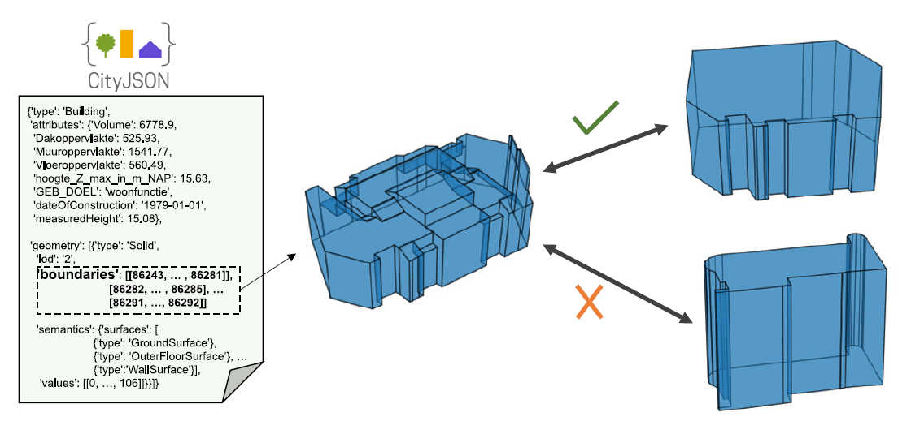

# 3dSAGER: Geospatial Entity Resolution over 3D Objects

Urban environments are continuously mapped and modeled by various data collection platforms, including satellites, unmanned aerial vehicles, and street cameras. The growing availability of 3D geospatial data from multiple modalities has introduced new opportunities and challenges for integrating spatial knowledge at scale, particularly in high-impact domains such as urban planning and rapid disaster management.

3dSAGER (3D Spatial-Aware Geospatial Entity Resolution) is an end-to-end pipeline for geospatial entity resolution over 3D objects. Unlike traditional methods that rely on spatial proximity, textual metadata, or external identifiers, 3dSAGER focuses on intrinsic geometric characteristics to robustly match spatial objects across datasets, even when coordinate systems are incompatible. A key component of 3dSAGER is BKAFI, a lightweight and interpretable blocking method that efficiently generates high-recall candidate sets. Extensive experiments on real-world urban datasets demonstrate significant improvements in both accuracy and efficiency compared to strong baselines.
<p align="center">
  
</p>

---

## Dataset
You can download the *The Hague* dataset [here](https://tinyurl.com/3dSAGERdataset).


[//]: # (Due to space constraints, we do not upload the full raw datasets &#40;as explained in the paper&#41;. Instead, we provide a processed version of the datasets &#40;object dictionary&#41;)

[//]: # ()
[//]: # (Currently, we publish only the **small variants** over **3 seeds**. The **large variant** will be uploaded soon.)

[//]: # ()
[//]: # (> **Important:**)

[//]: # (> )

[//]: # (> - Ensure that the parameter `load_object_dict` is set to **True** in the `config.py` file before running experiments.)

---

## Experiments

Experiments can be run using the provided `run_experiments.sh` script.

- To specify the type of evaluation, set the `eval_mode` parameter to either `blocking` or `matching` within the `run_experiments.sh` file.

Example:
```bash
bash run_expriments.sh
```

---

Stay tuned for updates including the release of the large dataset variant and additional evaluation scripts.
